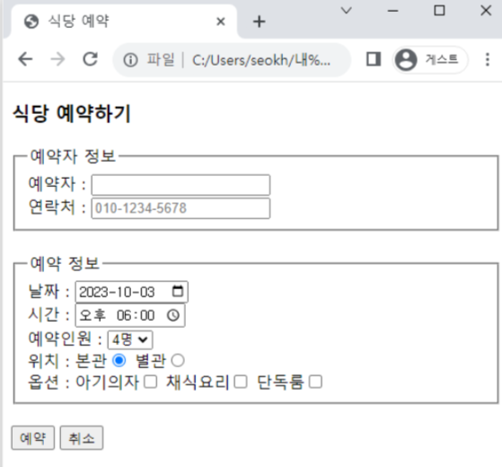

# web-programming
web programming class practice

### pr1 - 자기소개서
1. 브라우저에서 한 번 이상 화면이 스크롤 되는 분량
2. h2와 p를 사용하여 제목과 본문 구분
3. 페이지 상단에 각 단원을 연결하는 목차 작성
4. 본인 이미지 사용
5. 1개 이상의 외부 링크 사용
6. 1개 이상의 목록 사용
7. 이번 학기 시간표를 테이블로 작성
8. 시간표 테이블에 rowspan 필수 적용
9. 1개 이상의 YouTube 동영상 첨부 (재생 확인)
10. 과제 결과물 작성 및 제출 방법 충족

### pr2 - 식당 예약

1. 그림과 같은 구성의 식당 예약 폼을 만드시오
2. 그림과 같은 초기값을 적용한다
3. 가능한 모든 캡션에 label을 적용한다
4. 예약인원은 2~8명까지만 선택할 수 있다

### pr3 - 자기소개서2
1. 문서의 배경으로 벽지 느낌이 나도록 작은 이미지를 상하좌우 반복 패턴으로 삽입
2. 스타일을 사용하여 제목 부분을 화려한 웹 폰트를 사용하고 빨간색으로 변경
3. 시간표의 내용마다 고유한 컬러 지정
4. 과제 결과물 작성 및 제출 방법 충족